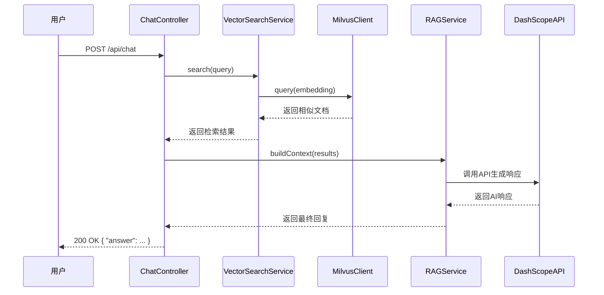
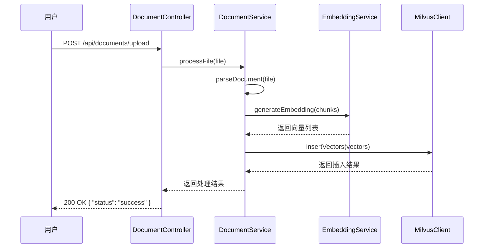

# Super Biz Agent 业务场景说明

## 一、项目概述

Super Biz Agent 是一个基于大语言模型的智能业务助手系统，旨在帮助企业员工快速获取内部知识和业务信息。

### 核心功能

| 功能模块 | 描述 | 状态 |
|---------|------|-----|
| **智能问答** | 基于知识库的问答服务 | ✅ 已实现 |
| **会话管理** | 多轮对话记忆与上下文维护 | ✅ 已实现 |
| **文档检索** | 向量数据库文档检索 | ✅ 已实现 |
| **文件上传** | 支持文档上传与解析 | ✅ 已实现 |
| **运维监控** | 系统监控与告警 | ✅ 已实现 |

---

## 二、典型业务场景

### 场景一：员工知识查询

**场景描述**：新入职员工需要了解公司内部流程和制度

**用户故事**：
```
作为一名新员工，我希望能够快速查询公司的请假流程，以便正确申请年假。
```

**使用流程**：
1. 员工登录系统
2. 输入问题："公司请假流程是怎样的？"
3. 系统检索知识库，返回请假流程文档
4. 员工查看详细流程说明

**预期结果**：
- 返回《员工请假管理规定》相关内容
- 包含请假类型、审批流程、注意事项等

---

### 场景二：技术文档查询

**场景描述**：开发人员需要查阅技术文档解决问题

**用户故事**：
```
作为一名后端开发，我需要了解项目中 Redis 的配置方式和使用规范。
```

**使用流程**：
1. 开发人员登录系统
2. 输入问题："Redis 缓存如何配置？"
3. 系统检索技术文档，返回相关配置说明
4. 开发人员获取配置示例和最佳实践

**预期结果**：
- 返回 Redis 配置文档
- 包含配置参数说明、连接池配置、使用示例

---

### 场景三：业务流程咨询

**场景描述**：销售人员需要了解客户合同审批流程

**用户故事**：
```
作为一名销售，我需要知道客户合同的审批流程和所需材料。
```

**使用流程**：
1. 销售人员登录系统
2. 输入问题："客户合同审批需要哪些材料？"
3. 系统检索业务流程文档
4. 返回合同审批流程和材料清单

**预期结果**：
- 返回合同审批流程图
- 列出所需材料清单
- 说明审批时间预估

---

### 场景四：故障排查指导

**场景描述**：运维人员遇到系统故障需要快速定位问题

**用户故事**：
```
作为运维人员，系统出现连接超时错误，我需要快速找到排查方法。
```

**使用流程**：
1. 运维人员登录系统
2. 输入问题："系统连接超时如何排查？"
3. 系统检索运维手册，返回故障排查步骤
4. 运维人员按照步骤排查问题

**预期结果**：
- 返回连接超时故障排查指南
- 包含检查步骤、日志位置、常见解决方案

---

## 三、用户角色与权限

### 角色定义

| 角色 | 描述 | 权限 |
|-----|------|-----|
| **普通用户** | 公司员工 | 查询知识库、上传文档 |
| **管理员** | 系统管理员 | 用户管理、文档审核、系统配置 |
| **运维人员** | IT运维人员 | 查看监控、执行运维操作 |

### 权限矩阵

| 操作 | 普通用户 | 管理员 | 运维人员 |
|-----|---------|-------|---------|
| 查询知识库 | ✅ | ✅ | ✅ |
| 上传文档 | ✅ | ✅ | ✅ |
| 管理用户 | ❌ | ✅ | ❌ |
| 审核文档 | ❌ | ✅ | ❌ |
| 查看监控 | ❌ | ✅ | ✅ |
| 系统配置 | ❌ | ✅ | ✅ |

---

## 四、数据流向

```
┌─────────────────────────────────────────────────────────────────────┐
│                        数据流向图                                  │
├─────────────────────────────────────────────────────────────────────┤
│                                                                    │
│  [用户请求]                                                         │
│      │                                                             │
│      ↓                                                             │
│  [ChatController] ──解析请求──→ [VectorSearchService]               │
│      │                                   │                          │
│      │                                   ↓                          │
│      │                            [MilvusClient]                    │
│      │                                   │                          │
│      │                                   ↓                          │
│      │                            [Milvus Server]                   │
│      │                                   │                          │
│      │                                   ↓                          │
│      │                            [向量检索结果]                    │
│      │                                   │                          │
│      │                                   ↓                          │
│      │                    [RAG 上下文构建]                          │
│      │                                   │                          │
│      │                                   ↓                          │
│      │                          [DashScope API]                     │
│      │                                   │                          │
│      │                                   ↓                          │
│      ←────────────────── [AI 响应结果] ──────────────────           │
│                                                                    │
│  [响应返回]                                                         │
│                                                                    │
└─────────────────────────────────────────────────────────────────────┘
```

---

## 五、核心业务流程

### 5.1 问答流程



### 5.2 文档上传流程



---

## 六、业务指标

### 6.1 关键性能指标（KPI）

| 指标 | 说明 | 目标值 |
|-----|------|-------|
| **问答准确率** | 正确回答的比例 | ≥ 85% |
| **响应时间** | 从提问到回复的时间 | ≤ 3秒 |
| **文档覆盖率** | 知识库覆盖的业务领域 | ≥ 90% |
| **用户满意度** | 用户反馈满意度评分 | ≥ 4.5/5 |
| **系统可用性** | 系统正常运行时间 | ≥ 99.9% |

### 6.2 运营指标

| 指标 | 说明 | 统计周期 |
|-----|------|---------|
| **日活用户数** | 每日活跃用户数量 | 日 |
| **问答次数** | 每日问答请求数量 | 日 |
| **文档上传量** | 每日上传文档数量 | 日 |
| **平均响应时间** | 问答平均响应时间 | 日 |
| **错误率** | 请求失败的比例 | 日 |

---

## 七、安全合规要求

### 7.1 数据安全

- **数据加密**：传输使用 HTTPS，存储加密敏感数据
- **访问控制**：基于角色的权限控制
- **数据脱敏**：敏感信息自动脱敏处理
- **审计日志**：记录所有操作日志

### 7.2 合规要求

- **隐私保护**：遵守个人信息保护法
- **数据留存**：按规定留存日志和数据
- **合规审计**：定期进行安全审计

---

## 八、扩展场景

### 8.1 未来规划

| 场景 | 描述 | 优先级 |
|-----|------|-------|
| **多语言支持** | 支持中英文问答 | 高 |
| **多模态检索** | 支持图片、语音等格式 | 中 |
| **智能推荐** | 根据用户行为推荐文档 | 中 |
| **移动端适配** | 支持移动端访问 | 低 |

### 8.2 集成场景

| 集成目标 | 描述 | 状态 |
|---------|------|-----|
| **企业微信** | 通过企业微信接入 | 规划中 |
| **钉钉** | 通过钉钉接入 | 规划中 |
| **Slack** | 通过 Slack 接入 | 规划中 |
| **内部系统** | 与 OA、CRM 系统集成 | 规划中 |